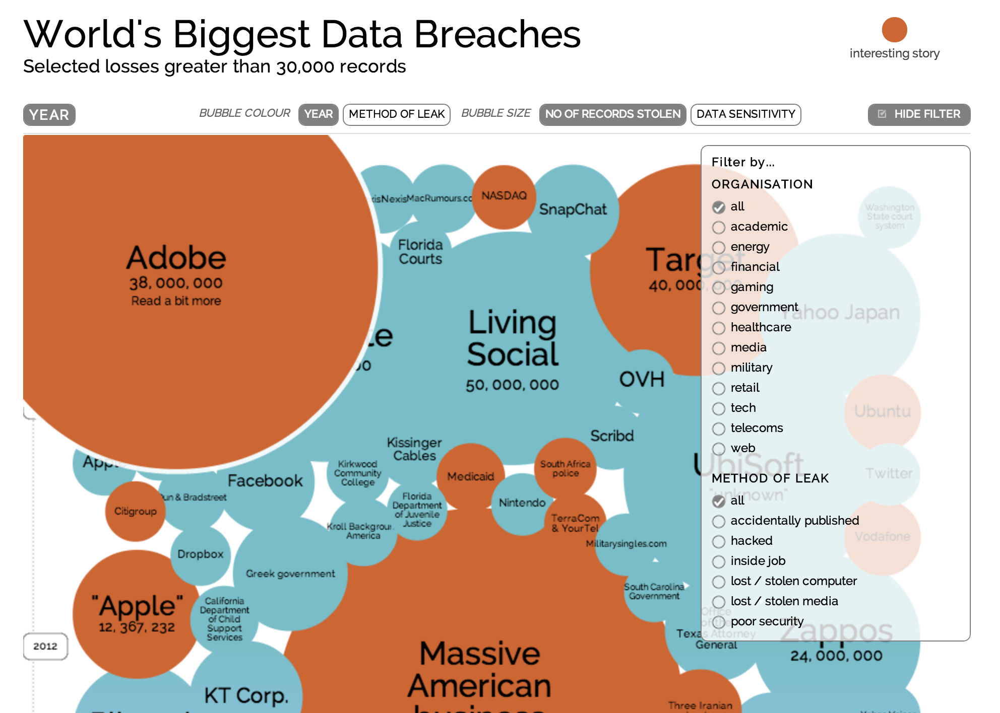

#Trust and Unknown In The Networked Society - Paranoia is Fair Reaction
####Geoff Hollingworth, Ericsson.  

##Introduction

**Society is moving online**.  We have an increasing dependance on digital information shared by us, kept by the companies we use, held by the companies we operate.   

Online is also changing.  The Internet is moving from serving documents to managing the real time status of **"THE WORLD RIGHT NOW"**.  

**Living in a safe society is as important when living online as it is when living offline.**  A society that is not safe can never function at its best optimum level.  At worse commerce stops and society breaks down.  The definition of safety in a civilized society is one where it is behaving as it is suppose to.  And since society is nothing more than a sum of its underlying systems, each system has to behave as it expected to.  **We have to trust this is true of the systems we depend upon and we serve.**  

In simple terms:

A Safe Society = the Sum of Safe Systems contained therein

A Safe System = one that behaves the way it should

Note we can have malintent systems as all societies do.  It is a civilized society's job to weed out and remove such systems that impede the "general good".  However even these malintent systems should function as they should.  

We are currently living in a world where this is very questionable.  We know online society is under attack.  Everyday a new breach of security and trust is reported.

* [Target sued by customers over credit card breach](http://www.bbc.co.uk/news/world-us-canada-25496284)
* [Sony PlayStation Network Hack To Cost $170 Million](http://www.huffingtonpost.com/2011/05/23/sony-playstation-network-hack-cost_n_865432.html)
* [New York utilities failed to protect customer information, report finds](http://www.infosecurity-magazine.com/view/26967/new-york-utilities-failed-to-protect-customer-information-report-finds/)

For an interactive journey through the all of the world's biggest data breaches click on the below image.

**The cost of attack is clearly very real and very significant.**

This trend is growing and it should not surprise us.  If you run any business you should be concerned and growingly so. There is big money to be made from online crime.  

* According to numbers collated by the Center for Strategic and International Studies, the United Nations Office on Drugs and Crime and antivirus firm Norton, **cybercrime is worth around $400 billion annually**
* "What we've seen is a stabilization for attacks for large organizations (93% of respondents), but in the small company arena we've seen quite a big jump, **from 76 to 87 percent of respondents being attacked**,”
* Security breaches at large companies **cost between £450,000 ($697,000) and £850,000 ($1.3 billion) on average**, in 2013. For a small business, a breach could cost anything between £35,000 and £65,000.
* PwC's 2013 research suggested that of those companies reporting cybercrime, there had been a 50 percent increase in security breaches from 2012, **with half of those breeches by internal users**.

References

* [The threat from cybercrime? 'You ain't seen nothing yet'](http://www.cnbc.com/id/100959481)
* [2013 Information Security Breaches Survey](http://www.pwc.co.uk/assets/pdf/cyber-security-2013-technical-report.pdf)
* [2013 US State of Cybercrime Survey](http://www.pwc.com/us/en/increasing-it-effectiveness/publications/us-state-of-cybercrime.jhtml)

The online community today is as exposed as the pioneers who chose to settle the Wild West 100 years ago.  The difference this time is that all of us are inhabiting the "Online Wild West".  Who can we trust? 

##Business Owners

If you are running or responsible for any kind of online business you are currently under attack. 
If you are a customer of any "online" service, such as using a credit card at Target, then you are exposed.

There are two continuous fears when responsible for any online activity

* **Fear of Unknown - "I don't know what is going on.  I may have been hacked and not know (Target)"**
* **Fear of Trust - I have to trust certain people/businesses - either internal or external**

First have you already been compromised and you don't know the distance between compromise and realization.  [**Over seven years**, five Russians and a Ukrainian used sophisticated hacking techniques to steal more than 160 million credit and debit card numbers, target more than 800,000 bank accounts and penetrate servers used by the Nasdaq stock exchange, federal prosecutors said Thursday.](http://www.nydailynews.com/news/national/russians-ukrainian-charged-largest-hacking-spree-u-s-history-article-1.1408948)

The distance between breach and realization equalled 40 million credit cards for Target.

The second fear is who can you trust.  Over 30% of cyber exploits are performed by internal employees. ([2013 US State of Cybercrime Survey](http://www.pwc.com/us/en/increasing-it-effectiveness/publications/us-state-of-cybercrime.jhtml))

Traditional online security has resonated around 3 basic paradigms. Linked are very good introductions to these topics by a [Joyent](http://joyent.com) expert.

* Confidentiality - [Joyent Introduction](http://www.joyent.com/blog/the-four-keys-of-cloud-security-confidentiality)
* Integrity - [Joyent Introduction](http://www.joyent.com/blog/the-four-keys-of-cloud-security-integrity)
* Availability - [Joyent Introduction](http://www.joyent.com/blog/the-four-keys-of-cloud-security-availability)

The least mature of these has always been integrity.  As any security expert will lecture, the first working assumption on securing any system is *to assume the credentials have been compromised*.

* **Is the file the same?**
* **Is the system the same?**

Is the file the same as yesterday?

Is the file the same as 5 years ago?

If the document is an affadavit for a murder trial 5 years ago then this is an important statement to make.  For Target the question they needed to ask was 

"**Is this software the same software that my POS company gave me?**"

###Solution

The nirvana of the Internet since the 90's has always been the creation of an "attributable Internet", one where data history exists and cannot be altered. This has been attempted before using PKI technology but this has never scaled and there has still beeen a need to trust the people who administer the keys.  

For the growing online cloud based world there is more and more need for trust.  Both as a provider and as a customer.  But trust is the most expensive currency to spend in any business transaction.  Trust is better when combined with transparency and very good when none ambigous proof is in place.  

This is the promise of mutual auditability and introduced here.

[Mutual Auditability Explained](http://www.joyent.com/blog/the-four-keys-of-cloud-security-mutual-auditability)

Keyless Signature Infrastructure (KSI) enables scale integrity tracking of data.  Guardtime operates KSI on a global basis for governments and private businesses.

##How to Create a Safe System

Systems already exist today.  They have implemented security yet breaches occur at an ever accelerating rate.  

Two critical questions need to be answered by all people operating such systems:

* **"How do I know that my system hasn't already been compromised?"**
* **"What are the critical actions that could lead to such a compromise and/or accusation?"**

eg. For example for Target one critical action was the upgrade of all point of sale terminals with compromised software. 

Instrumenting a system for mutual auditability is a paradigm shift in securing systems.  Rather than trying to create barriers it catalogues critical system changes building an auditable provable chain of record.

For example when Target upgraded it's point of sale terminals **it should have been able to ask "Is this the exact software that was delivered to me from the offical development?"**  The validation of such a question should be non-repudiable.

Then if breech still occured, while not ideal, **Target insurance could be indemnified and liability moved to the software provider**.  

Savings in the legal costs alone cover any implementation costs many times over.

Software upgrade is one example of a critical action in a system.  All such critical actions need to be mutually auditable.  

###In Conclusion

The technology behind mutual auditability is Key Signature Infrastructure (KSI).

The company operating KSI is Guardtime.  See [here](http://guardtime.com) for more information.

For more information on available instrumentation services see here

* [Guardtime Partner Certification](http://www.guardtime.com/services/partner-certification/)

**Trust by Guardtime**

